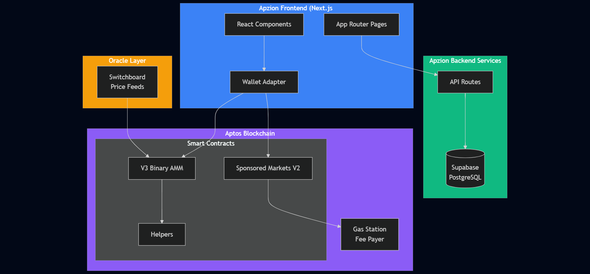

# Apzion Prediction Markets

A decentralized prediction market platform built on Aptos blockchain. Trade on real-world events with gasless transactions powered by sponsored gas.

## Features

- **Binary Markets** - Simple yes/no predictions with AMM-based pricing
- **Gasless Trading** - Users trade without paying gas fees (sponsored transactions)
- **Oracle Integration** - Automated resolution via Switchboard price feeds
- **Portfolio Tracking** - View positions, P&L, and trading history
- **Real-time Updates** - Live price updates and market data

## Tech Stack

- **Smart Contracts**: Aptos Move
- **Frontend**: Next.js 16, React 19, TypeScript
- **Styling**: Tailwind CSS, shadcn/ui
- **Database**: Supabase (PostgreSQL)
- **Oracles**: Switchboard
- **Wallet**: Aptos Wallet Adapter

## Architecture



```
┌─────────────────────────────────────────────────────────────┐
│                      Frontend (Next.js)                      │
│  ┌─────────────┐  ┌─────────────┐  ┌─────────────────────┐  │
│  │   Markets   │  │  Portfolio  │  │   Trading Panel     │  │
│  └─────────────┘  └─────────────┘  └─────────────────────┘  │
└───────────────────────────┬─────────────────────────────────┘
                            │
        ┌───────────────────┼───────────────────┐
        │                   │                   │
        ▼                   ▼                   ▼
┌───────────────┐   ┌───────────────┐   ┌───────────────┐
│   Supabase    │   │  Aptos Chain  │   │  Switchboard  │
│  (Database)   │   │  (Contracts)  │   │   (Oracles)   │
└───────────────┘   └───────────────┘   └───────────────┘
```

## Smart Contracts

Deployed on Aptos Testnet (Object-based):

| Contract | Address |
|----------|---------|
| Helpers | `0x3d214a29d718caf0c9d3ec918fa2dbf3f2f4315207a2b72cdb3079188ef33f97` |
| V3 Binary AMM | `0xf998b071b05f5a9b7fcbe2fc99b9022e311def8b686130f88c3ec333e3738b38` |
| Sponsored V2 | `0xd5765e51e155bc29ff569ef132b7ac39e7e358d238a071d6fb4f4a0f6f232869` |

## Getting Started

### Prerequisites

- Node.js 18+
- npm or yarn
- Aptos CLI (for contract deployment)

### Installation

```bash
# Clone the repository
git clone https://github.com/apzionio/apzdev.git
cd apzdev

# Install dependencies
npm install

# Set up environment variables
cp .env.example .env
# Edit .env with your configuration

# Run development server
npm run dev
```

### Environment Variables

```env
NEXT_PUBLIC_SUPABASE_URL=your_supabase_url
NEXT_PUBLIC_SUPABASE_ANON_KEY=your_supabase_anon_key
NEXT_PUBLIC_NETWORK=testnet
```

## Project Structure

```
src/
├── app/                 # Next.js app router pages
│   ├── page.tsx         # Home (markets list)
│   ├── portfolio/       # User portfolio
│   └── markets/[id]/    # Market detail
├── components/          # React components
│   ├── ui/              # shadcn/ui components
│   ├── Header.tsx       # Navigation header
│   └── markets/         # Market-related components
└── lib/                 # Utilities and services
```

## License

MIT
